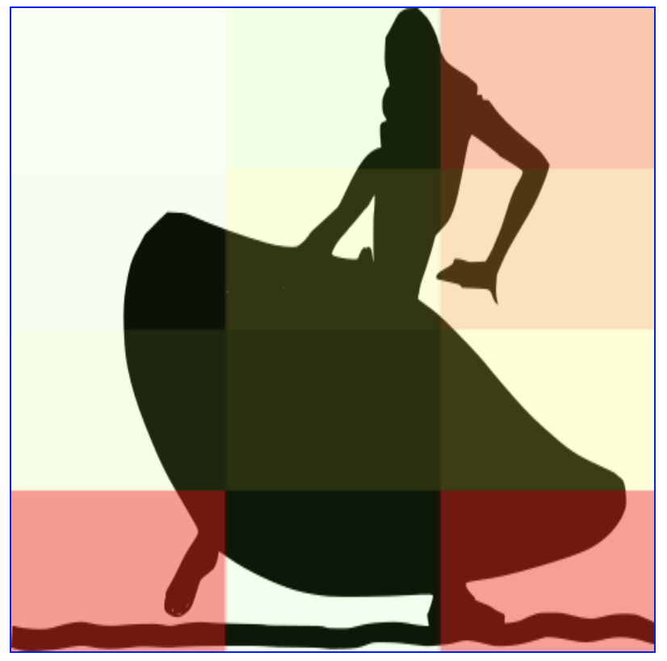

tbt-react-heatmap
=================
A heatmap react component with a background image, if you want 😎.
__Show your heatmap just by a few lines!__

# How it will look like
## 4x3 heatmap


## 4x3 heatmap with background image


# How to use
```js
import * as h from "tbt-react-heatmap";

const twelve = [
    [30, 70, 200],
    [40, 110.5, 170],
    [80.5, 100.23, 123.45],
    [250.23, 50.4, 245],
];

const render = () =>
    <h.Heatmap
        id="coveringCanvas"
        height={244}
        width={244}
        opacity={1.0}
        heatmapArray={twelve}
        src="sample-images/dancer-sample.png"
    />
```

# LICENSE MEMO
* [The background image of dancer-sample.png](https://svgsilh.com/image/294258.html): Creative Commons CC0
